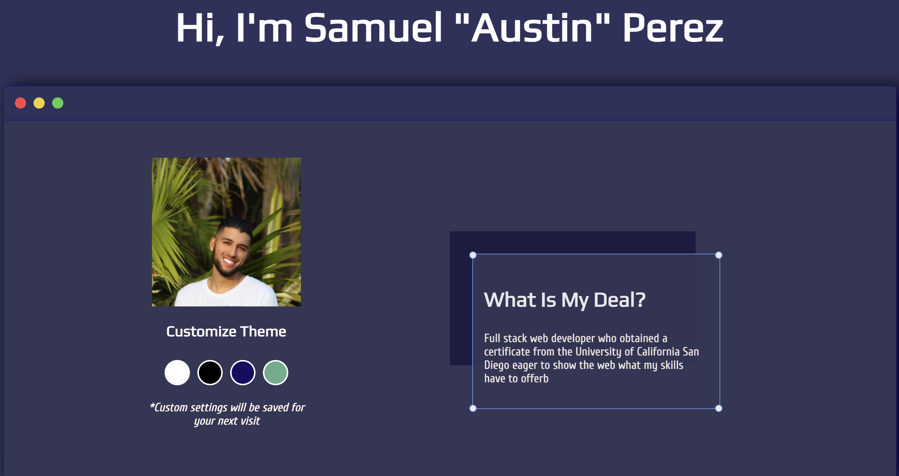

# React Portfolio

<p align="center">
  
</p>

[](https://opensource.org/licenses/MIT)



## Table of Contents

- [Description](#description)
- [Installation](#installation)
- [Usage](#usage)
- [License](#license)

<br>

## Description

Welcome to my personal portfolio using React. This project follows the same layout as my previous portfolio where a single page design covers all you need to know about myself.

Please check out my website here!
[here](https://austinperez760.github.io/Portfolio-1.0/).

## Installation

This application will require Node.js in order to insall properly.<br>
If cloning this repo begin enter these commands in the terminal:<br>

```bash
npm i
npm start
```

## Usage

- Once the page has loaded into the browser the user will see an introduction section where you can change the colorway or "theme" of the entire website.<br>
- Themes will be saved in local storeage so even if the user proceeds to close or refresh the page theme settings will stay consistent.
- Within the About me section users will find a short personal bio followed by the languages and technologies I am proficient in.
- You can find the links to download my resume as well as my LinkedIn and Github within the "About Me" section.
- The final section of my webpage displays some of my past projects and the links to the project repos.<br>

## License

[MIT](https://choosealicense.com/licenses/mit/#)
